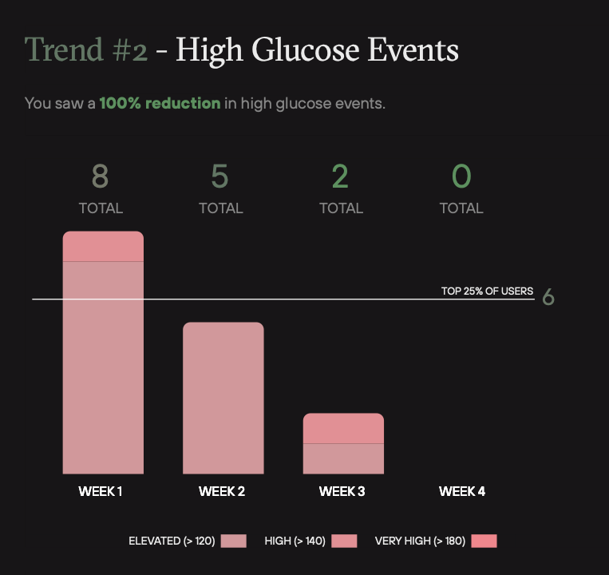
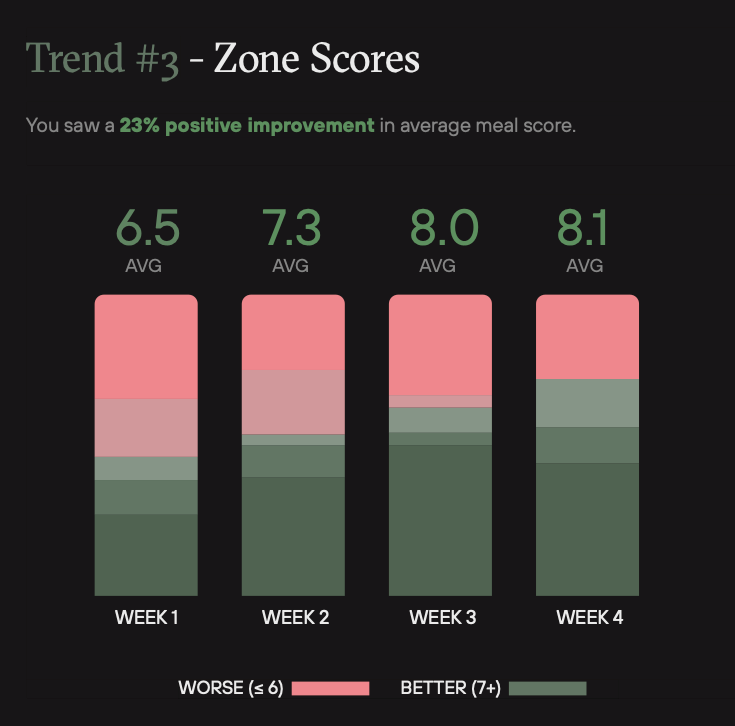
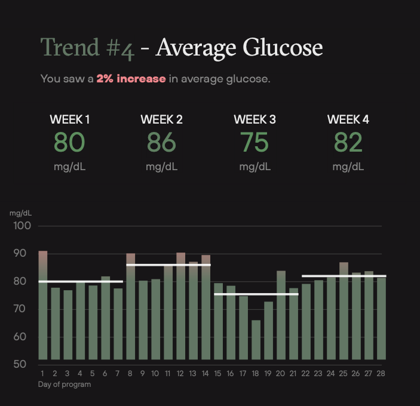
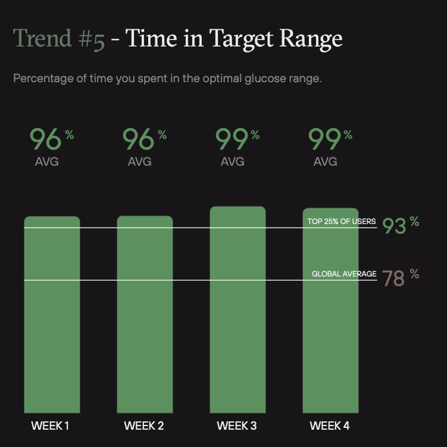

In June 2020, I experimented with a one month continuous glucose monitoring (CGM) program with a startup called[ Levels](https://www.levelshealth.com/). The data from the program led to meaningful shifts in my behavior and it was fun to see the impact of small changes in my diet. Even though it is now almost eight months later, I decided it was worthwhile to share a few of my observations.

## What is CGM?

A continuous glucose monitor is a small sensor applied to the skin that can continuously monitor your blood sugar level in real time. It contains a tiny filament that extends a few centimeters into the skin and takes blood sugar readings in between your cells. The sensor includes a transmitter to send the readings to your phone wirelessly. The Levels program specifically uses the [FreeStyle Libre](https://www.freestylelibre.us/) system.

## Why CGM?

There is a lot of information floating around about which foods and diets are most "healthy". It's hard to know what is effective and what isn’t. Diets that claim to be the most effective also generally require the most drastic changes in food habits, making them harder to stick to.

The reality is that everyone responds to food in different ways. Our genetics, physical make-up, and other factors can all influence how diet affects our bodies. It doesn't make sense to treat blanket recommendations as applicable to everyone.

Still, there is substantial evidence that elevated glucose levels and post-meal glucose spikes can lead to metabolic dysfunction over time and increase risk of a lot of major diseases. If you want more of an in-depth look into why this is the case, I recommend the Levels Blog and the [article on creating an optimal diet through CGM](https://www.levelshealth.com/blog/optimal-diet).

By helping you track your glucose levels, continuous glucose monitoring gives you a personalized guide on how different foods impact your body. You can get immediate feedback after each meal and workout and modify your behavior based on what you see.

## Why did I write this?

During my month on CGM, there were many results that surprised me and got me excited to keep experimenting and learn more. None of these results are meant to be specific medical or dietary advice. I'm hoping that by sharing these discoveries, I can encourage you to create your own personal dietary experiments. You can see the effects of different foods on your body and perhaps even try a continuous glucose monitoring system.

## **Interesting Findings**

### Blood glucose dependent on intensity of exercise

The past three years have taken me on the journey of longer and longer triathlons. The longest race I’ve done, the half-Ironman, lasted six hours. I aim to one day do a full Ironman which would likely take 12+ hours.

We store between 2000-3000 calories of energy in the form of glycogen which enters as glucose into your bloodstream. Your body also stores between 20-30 thousand calories in fat. I can burn through the entire glycogen store in a six hour bike ride, if not more. To finish an additional run and swim, I would need to either replenish all the glycogen-based calories through food or burn calories stored in body fat. The former is very difficult, but the latter requires training

One of my fitness goals is to train my body to burn fat during races. Triathlon training guides suggest that the body consumes fat at lower intensities and carbohydrates (glycogen and blood glucose) at higher intensities. It is recommended to do many low-intensity workouts to train your body to burn fat instead of carbohydrates for long races.

I was curious to find the intensity ranges that did and did not require consuming glycogen. I used heart rate as a proxy for intensity. By measuring my blood glucose, I could see if I was turning glycogen into glucose and consuming it during exercise.

#### Low Intensity

On June 16th, I went on a 30 minute long, low intensity run, with an average heart rate of 142 beats per minute (bpm). For context, my maximum heart rate is approzximately 200 beats per minute.

My heart rate fell during two brief moments and increased above 142 on three occasions, but otherwise it stayed pretty close to 142 bpm throughout. Overall, I spent 73.9% of my run in Zone 2 (118-156 bpm) which is considered “low intensity” training.

My blood glucose started at 85 mg/dL and went up to 91 mg/dL about 20 minutes into the run before dipping back down to 79 mg/dL 30 minutes after the run.

#### High Intensity

On June 18th, I then went on a high intensity run, with an average heart rate of 166 bpm.

My heart rate was fairly elevated throughout the run and stayed between 160 and 180 bpm.. Overall, I spent 53.2% of my run in Zone 3 (156-175 bpm) and 27.9% of my run in Zone 4 (175-195 bpm) which is considered “high intensity” training.

My blood glucose started at 80 mg/dL. Over the course of the run, it spiked up to 150 mg/dL before dipping down to 75 mg/dL 30 minutes after the run.

The experiment showed a drastic difference in my body's blood sugar during low intensity and high intensity workouts. During low intensity (Zone 2) training, my blood glucose barely registered a spike. During high intensity (Zone 4) training, my blood glucose showed a drastic spike.

This confirmed that at high intensities, my body was converting lots of glycogen into glucose into my bloodstream to feed my muscles. At low intensities, my body was not converting as much glycogen into glucose and was likely burning more fat. This is valuable information I will use when training for my next triathlon.

### Glucose spikes for carbohydrates combined with fat and/or protein

One of the uses of monitoring blood glucose is to see how the body reacts to different combinations of foods. In a departure from the typical calories in/calories out model, scientists say that the physiological effects of diet are not only determined by the total net calories of foods consumed during the day, but also determined by the nutritional content of the foods as well as the way the foods are consumed[^1].

The CGM allowed me to test how my body reacts to carbohydrates when consumed in isolation versus in combination with fats or protein. The goal was to see if the addition of protein and fat affected my post-meal blood glucose levels.

On the first day of the experiment, June 13th, I woke up and ate one serving of freshly cooked oatmeal along with eggs cooked in 2 tablespoons of butter. On the second day of the experiment, June 14th, I woke up and ate one serving of freshly cooked oatmeal, plain. In both versions, I did not add any other carbohydrates (such as fruit, sugar, or bread).

#### Carbohydrates + Fat

On the first day, when I ate the oatmeal with eggs, I had the following blood glucose response. You can see that the CGM barely registered a spike, peaking at 91 mg/dL approximately 90 minutes after eating the carb + fat oatmeal breakfast.

#### Carbohydrates alone

On the second day, when I ate oatmeal alone, I had a different blood glucose response. You will notice that the CGM registered a much higher spike, peaking at 108 mg/dL approximately 45 minutes after eating the carb-only oatmeal breakfast.

This pattern of blood glucose spikes applied to other forms of carbohydrates as well. I was pretty surprised to find that desserts caused different blood glucose spikes depending on when and how I ate them.

Whereas pastries and cakes consistently caused massive spikes, ice cream didn't always cause the same degree of blood glucose spike, even though the overall sugar content was comparable in each type of dessert. The difference was most likely the added fat and protein coming from the dairy in the ice cream. Based on the data from the CGM, I could argue that my body was able to handle the glycemic load from ice cream better than other, less protein and fat-filled, desserts.

It would have been interesting to document the effects of consuming ice cream compared to consuming less fatty desserts such as an almond tart or green tea cake.

### Affecting Behavior Through Measurement

I have found that the best way to create long-standing change in something is to measure it. By receiving immediate feedback on how my body reacted to my diet and exercise, I was able to make adjustments to reach my goals. Without such measurements, it is a little bit like flying a plane without an airspeed indicator. I’ve included some ways that the Levels program brought changes to my behavior.

#### High Glucose Events

Over the four week program, I saw a 100% reduction in high glucose events. High glucose and repeated spikes are strongly correlated with inflammation, high insulin, and cardiometabolic dysfunction[^2].

This may be a bit drastic and perhaps a sign I was over zealous on my carbohydrate restriction by Week 4. However, many of the habits that I changed over the four weeks have been sustained even after I've stopped using my CGM. I believe that the CGM data played a big part because I could see the immediate effects of my changes in behavior.

#### Average meal score

The Levels program assigned a score from 1-10 to all my meals, which I was able to track with a picture and short description in the app. The score was based on the post-meal blood glucose response to the meal. A score above 7 was considered better. Over the four week program, my average meal score improved by 23%, again likely because I was able to see exactly what score each of my meals was given.

#### Gamification

At times, the Levels program felt like a game. I was challenging myself to reduce the variability on my average glucose and stay within the target range which was below 100 with a standard deviation less than 15. The positive feedback when I succeeded gave me the satisfaction to push forward and ignore my unhealthy food cravings.

## **What's Next?**

#### Keep more variables constant

During my experimentation, I was not as diligent as I would have liked in limiting the number of variables that could have been confounding factors in my results. These include:

- Time of day eating meals. If the experiment was breakfast, how long prior was the previous meal?
- Overall activity level that day
- Amount of sleep the night before

In future iterations, I would like to do a better job of measuring these variables and keeping them constant if not being tested explicitly.

#### Effects of fasting on blood glucose

This year, I have started experimenting with fasting, with each fast lasting 24+ hours. Next time I try Levels, I’d like to see the effects on 24-72 hour fasts on blood glucose during and after the fast. How does exercise affect my blood glucose during the fast? Does my body process the same foods differently after a 24 hour fast compared to normal circumstances?

#### Additional experimentation

- I noticed anecdotally that exercise tended to dampen the effect of carbohydrates on my blood glucose. The same foods, eaten after a long run or bike ride, resulted in a much smaller blood glucose spike. Given my limited willpower to resist pastries, it's nice to know that I can eat them after a workout with less guilt than if I did not work out. I’d like to gather more data about this.
- I’d like to do more experimentation with walking before or after meals. I’ve heard of the benefits of walking compared to other forms of more intense exercise. It would be helpful to see more data on this.
- Does eating carbs first vs carbs last in a meal affect how my body processes it?

## Closing Remarks

While the technology is too expensive for widespread usage in its current form — Levels cost \$199/month — I believe continuous glucose monitoring is one component in the future of personalized medicine. I hope scientists and technologists need to continue to better understand the benefits of continuous glucose monitoring in maintaining metabolic health and bring down the cost of bringing these devices to the masses.

<!-- Footnotes themselves at the bottom. -->

## Notes

[^1]: Hall, Kevin D et al. “Energy balance and its components: implications for body weight regulation.” _The American journal of clinical nutrition_ vol. 95,4 (2012): 989-94. doi:10.3945/ajcn.112.036350
[^2]: Blaak, E E et al. “Impact of postprandial glycaemia on health and prevention of disease.” _Obesity reviews : an official journal of the International Association for the Study of Obesity_ vol. 13,10 (2012): 923-84. doi:10.1111/j.1467-789X.2012.01011.x
